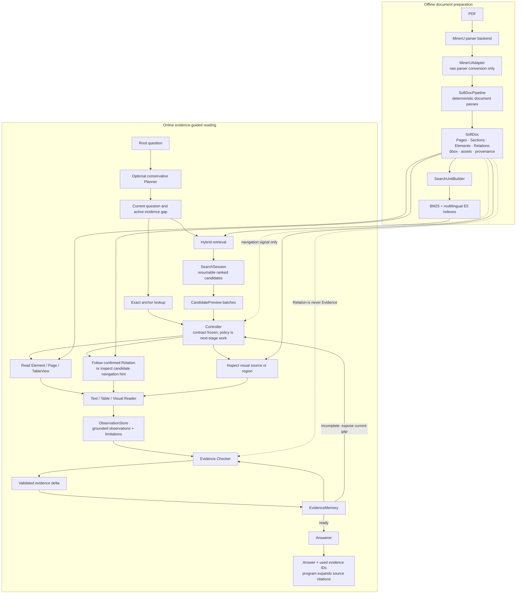
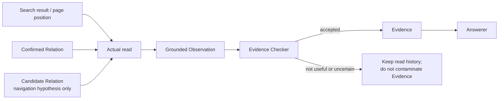

# TREVA Architecture

**TREVA** stands for **Typed-Relation Evidence-guided Visual Agent**. The name describes the intended research system; **SoftDoc** remains the parser-neutral document representation and `softdoc` remains the stable Python package and CLI name.

## End-to-end flow

## The safety boundary

The intended invariants are:

- retrieval finds a place to start reading; it does not select final answer context;
- confirmed Relations are normal navigation handles;
- candidate Relations are investigation hints, not facts;
- a Relation, CandidatePreview, page location, or Reader limitation is never Evidence by itself;
- Readers produce Observations, and only the Checker may admit them into EvidenceMemory;
- the Answerer receives accepted Evidence rather than raw retrieval or navigation state;
- every accepted Evidence item remains traceable through its Observation and ReadRecord to the underlying document source.

## Implementation status

Implemented and tested today:

- SoftDoc models, MinerU adapter, deterministic pipeline passes, typed Relations, provenance, assets, and validation;
- Exact lookup, SearchUnitBuilder, BM25, multilingual E5 dense retrieval, weighted RRF, SearchSession, and CandidatePreview;
- Planner, Reader, ObservationStore, ExplorationState, EvidenceMemory, Checker-delta, and Answerer contracts and validators.

Still research-stage work:

- the production Controller policy and executable reading loop;
- production-quality Reader and Evidence Checker models;
- deferred planning, Observation Recall, SFT/RL, and full-dataset end-to-end answer evaluation.

The diagram deliberately marks this boundary: it is a system design and contract map, not a claim that the final trained Agent already exists.
