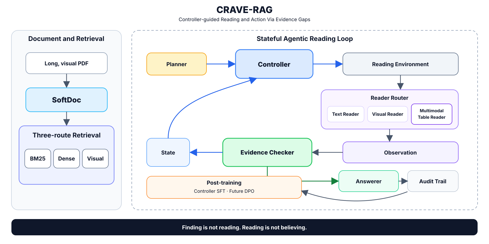

# CRAVE-RAG Architecture

**CRAVE-RAG** stands for **Controller-guided Reading and Action Via Evidence Gaps**. SoftDoc remains the parser-neutral document representation, and `softdoc` remains the stable Python package and CLI name.



## Core Loop

1. A question and the persistent candidate pool provide possible reading entry points.
2. The Controller chooses the next reading move using the current Evidence state and available document structure.
3. The selected Reader produces source-linked Observations.
4. The Evidence Checker evaluates progress, revises Evidence Memory, and maintains the active gap.
5. If Evidence is incomplete, control returns to the Controller. If it is sufficient, the Answerer responds using accepted Evidence.

## Safety Boundary

- Search results and candidate previews are reading leads, not Evidence.
- Confirmed Relations are navigation handles.
- Candidate Relations are investigation hints, not established facts.
- Readers produce Observations; only the Checker may admit them into Evidence Memory.
- The Answerer receives accepted Evidence rather than raw retrieval or navigation state.
- Accepted Evidence remains traceable through its Observation and read record to the underlying document source.

## Implementation Boundary

The repository implements and tests the SoftDoc foundation, MinerU adapter and deterministic passes, document relations, retrieval stack, resumable search sessions, candidate previews, the contracts for planning, reading, evidence checking, and answering, and an injectable Reading Environment v0 that executes those contracts as one stateful loop.

Production model-backed Readers and policies, citation materialization, model-quality evaluation, deferred planning, Observation Recall, post-training, and full-dataset end-to-end answer evaluation remain research-stage work.

## Executable Reading Loop

`src/softdoc/reading_environment.py` now connects the frozen contracts without
creating a second state model:

```text
activate current question
  -> resolve a unique exact anchor when possible
  -> otherwise let the Controller search or navigate
  -> execute a read and append a ReadRecord/Observation
  -> invoke the Checker when an Observation exists
  -> atomically apply the Evidence delta
  -> continue from the remaining gap, or invoke the Answerer when ready
```

The v0 boundary is intentionally strict:

- a unique Page or Element exact anchor is read before ordinary search;
- Search results and CandidatePreviews are never Evidence;
- Reader limitations survive even when no Observation is produced;
- confirmed relations may be followed from either visible endpoint without
  changing their canonical SoftDoc direction;
- candidate relations may be investigated but are not promoted to confirmed;
- invalid Checker deltas leave canonical EvidenceMemory unchanged;
- question advancement and Answerer invocation are program controlled;
- the Controller may stop explicitly without changing incomplete Evidence to ready;
- Relations whose other endpoint cannot be read by the current Environment are not exposed as actions;
- cross-store references are validated after every action.

`scripts/audit_reading_environment_v0.py` is a small real-SoftDoc replay audit.
Its scripted Teacher decisions replace unfinished learned components only to
test orchestration and state transitions; the report is not an Agent accuracy
score. Known v0 boundaries remain: Section exact anchors do not yet trigger
scoped reading, the resource budget is an action-count placeholder, and
production model backends are not part of this milestone.
